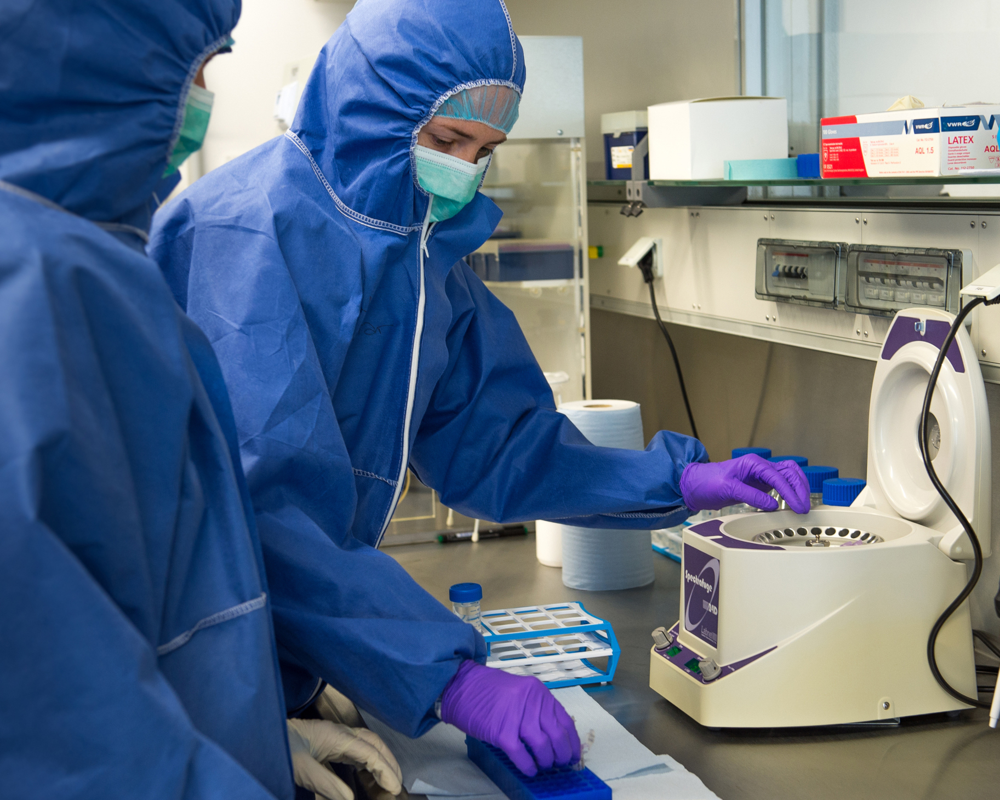
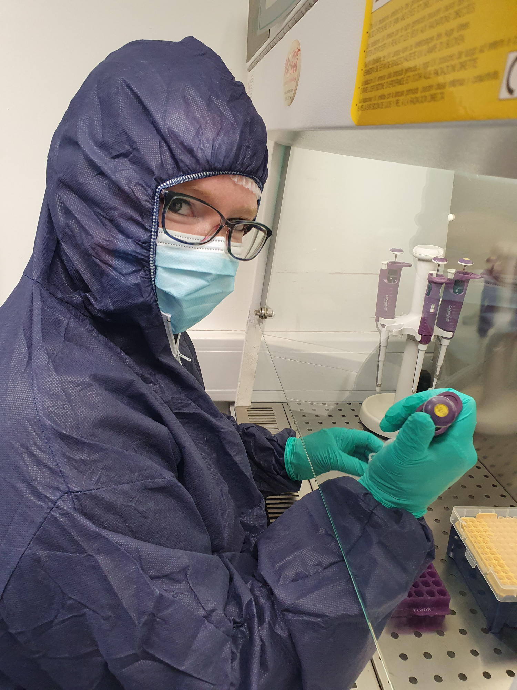

```{r setup, include=FALSE}
knitr::opts_chunk$set(echo = FALSE, dpi = 300)

library(knitr)
```


## Ancient DNA and conservation

1. Introduction to ancient DNA
2. Properties of ancient DNA
2. Analysis of ancient DNA
3. Case studies: 
    - Lynx
    - Whoolly Rhino
    - Great Auk

## Why is ancient DNA important?


## Tracking populations through time

```{r, out.height=490, fig.align='center'}
include_graphics("./img/1-onespeciesma_edit1.png")
```


<center><font size="4">*Credit: Claudiu Pantiru/Max Planck Institute for the Science of Human History*</font></center>


## Young research field (40 years) {.flex-col}  

```{r, out.width = "300"}
include_graphics("./img/Quagga_photo.jpg")
```


```{r, out.width = "100%", out.height=500}
include_graphics("./pdf/Higuchi_1984_Quagga.pdf")
```


## ...but highly prolific

```{r, out.height=470, fig.align='center'}

```

<center>*Svante Pääbo, Nobel Laureate 2022*</center>


## "Teething" problems...

```{r, out.width = "100%", out.height=500}
include_graphics("./pdf/Paabo_1985_mummy.pdf")
```

## Sorry, no dinosaurs... {.flex-col}

```{r, out.width = 300, fig.align='center'}
include_graphics("./img/riding_dino.png")
```

```{r, out.width = "100%", out.height=500}
include_graphics("./pdf/Woodward_1994_dino.pdf")
```


## First Pleistocene DNA in 1994 {.flex-col}

```{r, out.width = 300, fig.align='center'}
include_graphics("./img/woolly-mammoth-2722882.png")
```


```{r, out.width = "100%", out.height=500}
include_graphics("./pdf/Hagelberg_1994_mammoth.pdf")
```

## First Pleistocene genome in 2010 {.flex-col}

```{r, out.width = 300, fig.align='center'}

```


```{r, out.width = "100%", out.height=500}
include_graphics("./pdf/Green et al. - 2010 - A Draft Sequence of the Neandertal Genome.pdf")
```

## Where can you get it {.flex-col .vcenter}

- bones
- teeth
- soft tissue (permafrost, mummies)
- coprolites
- sediments

<br>

```{r, out.width = 550, fig.align='right'}

include_graphics("./img/big_bone.jpg")

```

## What can you get* {.columns-2}

- DNA fragmentation
- Small quantities
- High levels of contamination 
- DNA degradation

<font size="4">* *(usually) *</font>


```{r, out.width = 500, fig.align='right'}


```


## What can you get (in Bangor) {.columns-2}

```{r, out.width = "80%", fig.align='center'}
include_graphics("./img/cleanlab_axel.jpg")
```

```{r, out.width = "80%", fig.align='center'}

```

## Ancient DNA timeline {.flexbox .vcenter}

```{r, out.width = "100%", fig.align='center'}

```

<P align="right"><font size="4">*Dalén et al. 2023, Science*</font></P>


# Fragmentation

## DNA fragmentation

***→ Gets worse with time and poor preservation conditions***

```{r, out.width = 700, fig.align='center'}
include_graphics("./img/readlength.png")
```


## DNA fragmentation: PCR

```{r, out.width = 650, fig.align='center'}
include_graphics("./img/pcr_issue.svg")
```

## DNA fragmentation: PCR

```{r, out.width = 800, fig.align='center'}
include_graphics("./img/readlength_pcr.svg")
```

## DNA fragmentation: NGS

```{r, out.width = 800, fig.align='center'}
include_graphics("./img/library_molecule.svg")
```

## DNA fragmentation: NGS

```{r, out.width = 800, fig.align='center'}
include_graphics("./img/readlength.png")
```


# Low quantity / high contamination

## Endogenous vs exogenous DNA {.flex-col}

```{r, out.width="75%", fig.align='center', fig.width=4, fig.height=4}
par(bg = "transparent", mar=c(2, 4, 1, 2))

# Define the data
labels <- c("DNA you want", "Other Stuff")

# Create a bar chart
barplot(c(10, 90), names.arg = labels, col = c("red", "darkgrey"), 
        ylim = c(0, 100), ylab = "Amount of output data", border = "white")

```

```{r, out.height = 500, fig.align='center'}
include_graphics("./img/contamination.svg")
```

## "Brute force" sequencing

```{r, out.width = 800, fig.align='center'}

```


## Targetting the right sample  {.flex-col}


```{r, out.width = 550, fig.align='center'}
include_graphics("./img/alberti_petrous_skull.svg")
```


```{r, out.width = 450, fig.align='center'}
include_graphics("./img/alberti_petrous.png")
```


## Targetting the right sample 

```{r, out.width = 700, fig.align='center'}
include_graphics("./img/outermost_layer.png")
```

## Hybridisation capture

```{r, out.width = 650, fig.align='center'}
include_graphics("./img/capture_workflow.svg")
```


# DNA degradation

## Chemical DNA damage {.flexbox .vcenter}


```{r, out.height = "100%", fig.align='center'}
include_graphics("./img/sad_dna.svg")
```

***→ Gets worse with time and poor preservation conditions***


## Nucleotide misincorporations

```{r, out.height=550, fig.align='center'}
include_graphics("./img/mapdam.svg")
```


## Nucleotide misincorporations {.white-slide}


```{r, out.height = 520, fig.align='center'}
include_graphics("./img/consensify1.svg")
```

## Nucleotide misincorporations {.white-slide}


```{r, out.height = 520, fig.align='center'}

```


# Applications


## Lynx

"Natural genetic rescue"


## Whooly rhino

"Extinction processes"

## Great Auk

- "Conservation genetics"

## Conclusion {.thank-you-slide}


